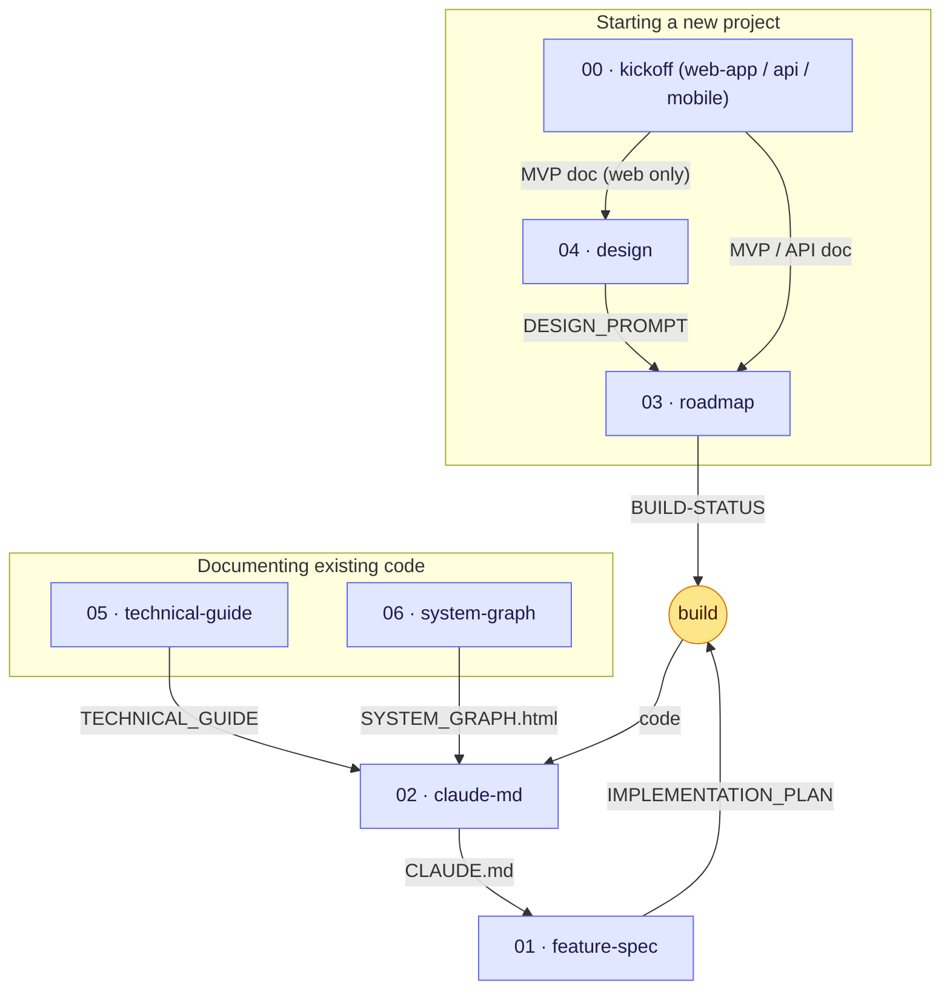

# App Starter Prompts

A collection of structured AI prompts for the software project lifecycle — kicking off new projects, planning features, and documenting existing codebases. Use these as starting points when working with an AI coding assistant to produce a complete, implementation-ready spec.

## How to use

1. Pick the prompt that matches your situation (see table below)
2. Copy the entire file contents
3. Paste it into your AI assistant as your first message
4. Answer the staged questions — the AI guides you through them one stage at a time
5. At the end, the AI generates the output documents
6. Save those files into your project's `/docs` folder and start building

## Prompts

Each prompt's output files are detailed under [Output documents](#output-documents) below.

| File | Purpose |
| --- | --- |
| [docs/00-kickoff-web-app.md](docs/00-kickoff-web-app.md) | Web / frontend project kickoff |
| [docs/00-kickoff-api.md](docs/00-kickoff-api.md) | API / backend project kickoff |
| [docs/00-kickoff-mobile.md](docs/00-kickoff-mobile.md) | Mobile app (client) kickoff |
| [docs/01-feature-spec.md](docs/01-feature-spec.md) | Plan a new feature in an existing project |
| [docs/02-claude-md.md](docs/02-claude-md.md) | Generate a `CLAUDE.md` quick-reference for an existing codebase |
| [docs/03-roadmap.md](docs/03-roadmap.md) | Plan phased rollout and track build progress |
| [docs/04-design.md](docs/04-design.md) | Generate a reusable design system prompt for AI design tools |
| [docs/05-technical-guide.md](docs/05-technical-guide.md) | Document an existing codebase in depth |
| [docs/06-system-graph.md](docs/06-system-graph.md) | Map an existing codebase to an interactive diagram |

## How the prompts chain

The prompts aren't standalone — outputs from one become inputs to the next. There are two entry points depending on whether you're starting fresh or documenting code that already exists.

Read it as two tracks feeding one pipeline. The upper track turns an idea into a buildable plan (kickoff → design/roadmap → build); the lower track reverse-engineers code that already exists (technical-guide / architecture-map). Both converge on `02-claude-md`, after which `01-feature-spec` drives each new unit of work and loops back into the build.

**Typical flows:**

- **New web/API project:** `00-kickoff-*` → feed the MVP/API doc into `04-design` (web) and `03-roadmap` → build against `BUILD-STATUS.md` → generate `02-claude-md` once code exists.
- **Existing codebase:** `05-technical-guide` and/or `06-system-graph` to map it → `02-claude-md` for an AI quick-reference.
- **Ongoing work (either track):** `01-feature-spec` per feature → build → repeat.

`02-claude-md` is the hinge: run it once real code exists so every later session starts with accurate context.

## Examples

Finished sample outputs live in [`examples/`](examples):

- [`examples/00-kickoff-web-app/`](examples/00-kickoff-web-app) — sample `MVP_DOCUMENT.md`, `DECISIONS.md`, `OPEN_QUESTIONS.md`
- [`examples/00-kickoff-api/`](examples/00-kickoff-api) — sample `API_DOCUMENT.md`, `DECISIONS.md`, `OPEN_QUESTIONS.md`
- [`examples/00-kickoff-mobile/`](examples/00-kickoff-mobile) — sample `MOBILE_DOCUMENT.md`, `DECISIONS.md`, `OPEN_QUESTIONS.md`
- [`examples/01-feature-spec/`](examples/01-feature-spec) — sample `FEATURE_SPEC.md`, `IMPLEMENTATION_PLAN.md`
- [`examples/02-claude-md/`](examples/02-claude-md) — sample `CLAUDE.md`
- [`examples/03-roadmap/`](examples/03-roadmap) — sample `ROADMAP.md`, `BUILD-STATUS.md`
- [`examples/04-design/`](examples/04-design) — sample `DESIGN_PROMPT.md`
- [`examples/05-technical-guide/`](examples/05-technical-guide) — sample `TECHNICAL_GUIDE.md`
- [`examples/06-system-graph/`](examples/06-system-graph) — sample `SYSTEM_GRAPH.html`, `system-graph.json`

Use them to calibrate prompt changes and check whether generated outputs are concrete enough to implement.

## Maintenance

- `docs/` is the source of truth for prompt behavior and required output sections.
- `examples/` are canonical reference outputs and should stay structurally aligned with the current prompts.
- If a prompt's output contract changes, update the corresponding files in `examples/` in the same PR.
- Run `./scripts/validate.sh` after changing `docs/` or `examples/`.

## Output documents

**Kickoff prompts** (`00-kickoff-*.md`) produce:

- **MVP_DOCUMENT.md / API_DOCUMENT.md / MOBILE_DOCUMENT.md** — complete implementation spec. Web: pages, schema, endpoints. API: endpoints, contracts, data. Mobile: screens & navigation, device permissions, offline/sync, backend dependencies, push, app-store release. All include security, project structure, env vars, and build order.
- **DECISIONS.md** — architectural decision records (ADRs) with alternatives and rationale
- **OPEN_QUESTIONS.md** — unresolved questions, edge cases, and post-v1 ideas

**Feature spec** (`01-feature-spec.md`) produces:

- **FEATURE_SPEC.md** — complete feature spec (flows, UI, API/data changes, permissions, edge cases, observability, rollout)
- **IMPLEMENTATION_PLAN.md** — task breakdown with acceptance criteria, dependencies, and risk table

**CLAUDE.md generator** (`02-claude-md.md`) produces:

- **CLAUDE.md** — AI quick-reference: stack, commands, structure, conventions, env vars, do-nots

**Roadmap & build status** (`03-roadmap.md`) produces:

- **ROADMAP.md** — phased plan with decision log, non-goals, success criteria, and exit gates per phase
- **BUILD-STATUS.md** — live workstream tracker pre-populated from the spec, with source-of-truth pointers and task lists

**Design system prompt** (`04-design.md`) produces:

- **DESIGN_PROMPT.md** — master design prompt plus page-specific and component variant prompts for AI design tools (v0.dev, Bolt, Lovable, Stitch, Galileo)

**Technical guide** (`05-technical-guide.md`) produces:

- **TECHNICAL_GUIDE.md** — in-depth codebase reference: architecture diagram, data model, subsystems, API/frontend maps, testing, local dev, deployment, security, patterns, glossary, and future work

**System graph** (`06-system-graph.md`) produces:

- **SYSTEM_GRAPH.html** — a single self-contained interactive page: components grouped by role, click a flow to highlight its path and step-by-step payloads
- **system-graph.json** — the same map as structured data for the next agent or tool (embedded inside the HTML so the page works offline)
