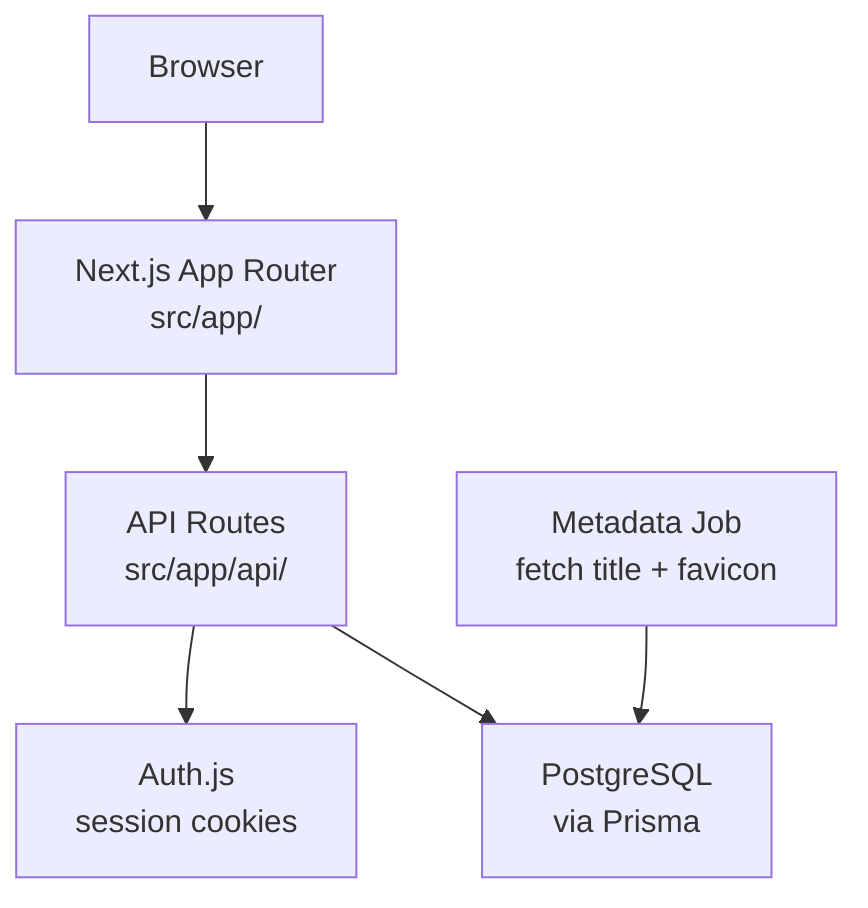

# LinkVault — Technical Guide

## 1. What This Is

`linkvault` is a full-stack web application for saving, tagging, and sharing bookmarks. Users save links, organize them with tags, and publish read-only public collections.

**One-line mission:** *Save a link in one click; find it again in one search.*

It serves two roles:

1. **Members** — signed-in users who save links, manage tags, and publish collections.
2. **Visitors** — anonymous viewers who open a member's public collection by its share slug.

**Current state:** actively developed, in production for a small user base.

**Major moving parts:** a Next.js web app (UI + API routes), a PostgreSQL database, and a daily background job that fetches link metadata.

## 2. Architecture



### Request flow — saving a link

1. Browser sends `POST /api/links` with `{ url, tags[] }`
2. Route verifies the Auth.js session; rejects with `401` if absent
3. Validates the body against a Zod schema
4. Inserts a `link` row with `status = "pending"` and the user's id
5. Returns `{ link }` immediately
6. The next metadata-job run fills in `title` and `faviconUrl`, sets `status = "ready"`

## 3. Repository Structure

```text
linkvault/
├── src/
│   ├── app/                  Next.js App Router pages and API routes
│   │   ├── (app)/            Signed-in member UI
│   │   ├── c/[slug]/         Public collection view
│   │   ├── api/              Route handlers
│   │   └── signin/           Auth pages
│   ├── components/           Reusable UI components
│   ├── lib/
│   │   ├── auth.ts           Auth.js configuration
│   │   ├── db.ts             Prisma client singleton
│   │   └── schemas.ts        Zod request schemas
│   └── jobs/
│       └── fetch-metadata.ts Daily metadata backfill
├── prisma/
│   └── schema.prisma         Database schema
├── .env.example
└── package.json
```

## 4. Tech Stack

| Layer | Technology | Why |
|---|---|---|
| Framework | Next.js 15 (App Router) | Single codebase for UI and API routes |
| Language | TypeScript | Type safety across the stack |
| Database | PostgreSQL | Relational data, tags-to-links many-to-many |
| ORM | Prisma | Typed queries, easy migrations |
| Auth | Auth.js | Cookie sessions, GitHub OAuth, no vendor lock-in |
| Validation | Zod | Shared schemas for form and API validation |
| Styling | Tailwind CSS | Utility-first, no runtime cost |
| Testing | Vitest | Fast, Vite-native unit tests |
| Hosting | Vercel | Serverless functions, PR previews |

## 5. Data Architecture

### `user`

| Column | Type | Purpose |
|---|---|---|
| `id` | uuid | Primary key |
| `email` | text | Login email (unique) |
| `name` | text | Display name |
| `createdAt` | timestamp | Signup time |

### `link`

| Column | Type | Purpose |
|---|---|---|
| `id` | uuid | Primary key |
| `userId` | uuid | FK to `user` |
| `url` | text | The saved URL |
| `title` | text | Fetched by the metadata job |
| `faviconUrl` | text | Fetched by the metadata job |
| `status` | enum | `pending` → `ready` / `failed` |
| `createdAt` | timestamp | Save time |

### `tag` and `link_tag`

`tag` holds `{ id, userId, name }`. `link_tag` is the join table (`linkId`, `tagId`) for the many-to-many between links and tags.

### `collection`

| Column | Type | Purpose |
|---|---|---|
| `id` | uuid | Primary key |
| `userId` | uuid | FK to `user` |
| `slug` | text | Public share slug (unique) |
| `isPublic` | boolean | Whether the slug resolves |

**Link status lifecycle:**

```
pending → ready
        → failed
```

## 6. Core Subsystems

### Authentication

Auth.js handles all auth flows via the catch-all route `src/app/api/auth/[...nextauth]/route.ts`. Sessions are cookie-based. GitHub OAuth is the only provider.

API routes guard themselves with a shared helper:

```typescript
const session = await auth();
if (!session) return Response.json({ error: "Unauthorized" }, { status: 401 });
```

There is no admin role — every member only ever touches their own rows, enforced by a `userId` filter on every query.

### Metadata job

`src/jobs/fetch-metadata.ts` runs daily via a Vercel Cron. It selects links with `status = "pending"`, fetches each URL's `<title>` and favicon, and updates the row to `ready` (or `failed` after 3 attempts). It is idempotent — re-running only touches `pending` rows.

### Public collections

`src/app/c/[slug]/page.tsx` renders a read-only collection when `collection.isPublic` is true. The query never joins `user` private fields, so visitor responses cannot leak member data.

## 7. API Reference

### Public routes

| Method | Path | Purpose |
|---|---|---|
| `GET` | `/api/collections/[slug]` | Fetch a public collection's links |

### Authenticated routes

| Method | Path | Purpose |
|---|---|---|
| `GET` | `/api/links` | List the member's links |
| `POST` | `/api/links` | Save a new link |
| `DELETE` | `/api/links/[id]` | Delete a link |
| `POST` | `/api/tags` | Create a tag |
| `POST` | `/api/collections` | Create or update a collection |

### Webhooks

| Method | Path | Purpose |
|---|---|---|
| `POST` | `/api/auth/[...nextauth]` | Auth.js (all auth flows) |

## 8. Frontend

State management: server state via React Query, no global client store. Navigation uses the App Router file tree.

| Route | Component | Notes |
|---|---|---|
| `/` | `app/(app)/page.tsx` | Link list with search + tag filter |
| `/collections` | `app/(app)/collections/page.tsx` | Manage public collections |
| `/c/[slug]` | `app/c/[slug]/page.tsx` | Public read-only collection |
| `/signin` | `app/signin/page.tsx` | GitHub sign-in |

## 9. Testing

42 Vitest tests in `src/lib/__tests__/`, all under one second.

| Test file | What's tested |
|---|---|
| `schemas.test.ts` | Zod validation for link and collection bodies |
| `slug.test.ts` | Slug generation and uniqueness |
| `metadata.test.ts` | Title/favicon parsing, failure after 3 attempts |

### What is not tested

- API route handlers (no integration tests yet)
- UI components
- The Vercel Cron trigger itself

## 10. Local Development

### Prerequisites

- Node.js 20+
- A local or hosted PostgreSQL database
- A GitHub OAuth app (client id + secret)

### Setup

```bash
git clone https://github.com/example/linkvault
cd linkvault
npm install
cp .env.example .env        # fill in DATABASE_URL + GitHub OAuth
npm run db:migrate          # apply Prisma migrations
npm run dev                 # start on http://localhost:3000
```

### Commands

```bash
npm run dev          # Next.js dev server
npm run build        # production build
npm test             # Vitest
npm run db:migrate   # apply migrations
npm run db:studio    # Prisma Studio GUI
```

### Common issues

- **Auth redirect loop** — ensure `AUTH_URL` matches the dev origin exactly.
- **`P1001` from Prisma** — `DATABASE_URL` is unreachable; check the host and SSL mode.
- **Metadata never fills in** — the cron does not run locally; call `npm run fetch:once` to trigger it manually.

## 11. Environment Variables

| Variable | Required | Secret | Purpose |
|---|---|---|---|
| `DATABASE_URL` | ✅ | ✅ | PostgreSQL connection string |
| `AUTH_SECRET` | ✅ | ✅ | Session signing secret |
| `AUTH_URL` | ✅ | ⬜ | App base URL |
| `GITHUB_CLIENT_ID` | ✅ | ⬜ | GitHub OAuth client id |
| `GITHUB_CLIENT_SECRET` | ✅ | ✅ | GitHub OAuth client secret |

## 12. Deployment

Deployed to **Vercel** via its GitHub integration on push to `main`.

### Branch flow

```
feature branch → PR → preview deployment → merge to main → production
```

### Cron

The metadata job runs daily at 06:00 UTC, configured in `vercel.json` as a Cron hitting `GET /api/cron/fetch-metadata`, guarded by the `CRON_SECRET` header.

## 13. Security Model

- Every authenticated query filters by `session.user.id`; a member can never read another member's rows.
- Public collection queries select only non-sensitive fields.
- All request bodies are validated with Zod before touching Prisma; Prisma uses parameterized queries (no raw SQL).
- The cron endpoint requires a matching `CRON_SECRET` header.

## 14. Key Patterns

### Ownership filter on every query

Every member query includes `where: { userId: session.user.id }`. This is the single authorization boundary — there is no separate permission layer, so the filter must never be omitted.

### Status-driven metadata

Links are saved instantly as `pending` and enriched later. The UI renders a placeholder until `status = "ready"`, so saving never blocks on a slow external fetch.

### Shared Zod schemas

The same schema in `src/lib/schemas.ts` validates both the client form and the API body, so the two can never drift apart.

## 15. Glossary

**collection**
A named, shareable set of a member's links exposed at `/c/[slug]` when `isPublic` is true.

**link status**
`pending` (saved, awaiting metadata), `ready` (metadata fetched), `failed` (fetch gave up after 3 attempts).

**ownership filter**
The `where: { userId }` clause present on every authenticated query — the app's only authorization mechanism.

**slug**
The unique, URL-safe string identifying a public collection.

## 16. File-by-File Reference

### Infrastructure

- `src/lib/db.ts` — Prisma client singleton
- `src/lib/auth.ts` — Auth.js configuration
- `src/lib/schemas.ts` — shared Zod request schemas

### Business logic

- `src/jobs/fetch-metadata.ts` — metadata backfill job

### Key routes

- `src/app/api/links/route.ts` — list + save links
- `src/app/api/collections/route.ts` — create/update collections
- `src/app/c/[slug]/page.tsx` — public collection view

### Schema

- `prisma/schema.prisma` — all tables and relations

## 17. Future Work

1. **Integration tests for API routes** — current tests cover pure helpers only; route-level tests would catch missing ownership filters.
2. **Full-text search** — search is a simple `ILIKE`; a Postgres `tsvector` index would scale better.
3. **Bulk import** — no way to import bookmarks from a browser export file yet.
4. **Collection collaborators** — collections are single-owner; shared editing is unscoped.
